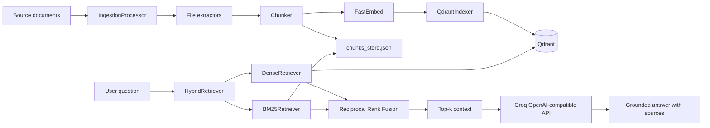

# Hybrid RAG Architecture

## Overview

The application uses a two-stage pipeline:

1. **Indexing:** source documents are extracted, chunked, embedded, and stored
   in both Qdrant and a local JSON chunk store.
2. **Querying:** a question is sent to dense and sparse retrievers in parallel;
   their ranked results are fused with Reciprocal Rank Fusion before optional
   LLM generation.

## Component diagram

## Indexing flow

1. `main.py` scans `data/` through `IngestionProcessor`.
2. The processor selects an extractor using the file extension registry.
3. Extracted text is split into overlapping chunks.
4. The chunks are serialized to `chunks_store.json` for BM25 lookup.
5. FastEmbed generates 384-dimensional vectors using
   `BAAI/bge-small-en-v1.5`.
6. `QdrantIndexer` creates or updates the `website_knowledge` collection and
   stores vectors with source, chunk index, and text payloads.

## Query flow

1. `HybridRetriever` receives a natural-language question.
2. `DenseRetriever` embeds the question and searches Qdrant by vector
   similarity.
3. `BM25Retriever` tokenizes the question and scores the persisted chunks for
   exact-term relevance.
4. `reciprocal_rank_fusion` combines both ranked lists. This preserves useful
   exact matches while also recovering paraphrases and semantically similar
   content.
5. The top fused chunks become the LLM context.
6. `query_hybrid.py` sends the context and question to Groq through its
   OpenAI-compatible API.
7. The prompt requires answers to use only the supplied context and cite source
   files.

## Runtime boundaries

| Component | Responsibility | Persistence |
| --- | --- | --- |
| Extractors | Convert supported files into text/documents | None |
| Chunker | Produce overlapping retrieval units | None |
| FastEmbed | Generate local dense vectors | Model cache |
| Qdrant | Dense vector search and payload storage | Docker volume |
| JSON chunk store | Input for BM25 sparse search | `chunks_store.json` |
| BM25 | Exact-term retrieval | In-memory per process |
| RRF | Merge dense and sparse rankings | None |
| Groq | Generate the final grounded response | External API |

## Design rationale

Dense retrieval handles paraphrases and conceptual similarity, while BM25 is
strong at product names, plan names, error codes, and other exact terms.
Combining them reduces the weaknesses of either approach alone. Keeping the
retrieval layer separate from generation also allows the system to be used for
search-only workflows and makes retrieved sources inspectable before an LLM
call.

## Failure handling

- Missing source directories and files raise explicit errors.
- Unsupported extensions are rejected by the ingestion router.
- Individual files that fail extraction are reported and skipped during
  directory ingestion.
- Missing `chunks_store.json` produces an actionable error instructing the user
  to run `python main.py`.
- Missing API credentials fail at the LLM client boundary rather than silently
  returning an ungrounded response.
